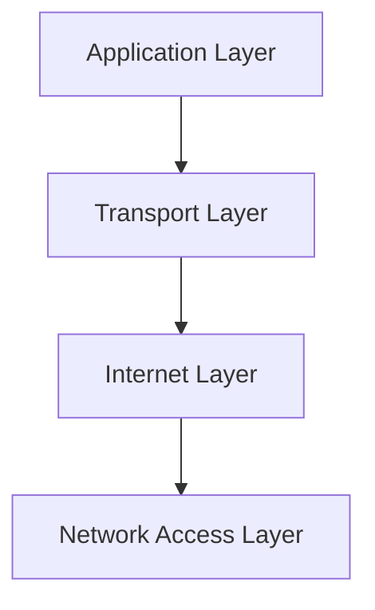

```mermaid
graph TB;
    A[Application Layer]
    B[Transport Layer]
    C[Internet Layer]
    D[Network Access Layer]
   
    A --> B
    B --> C
    C --> D
```

Four Layers of TCP/IP model.

{:.success}

<!--more-->

# TCP/IP

